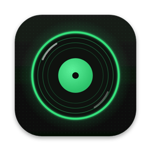
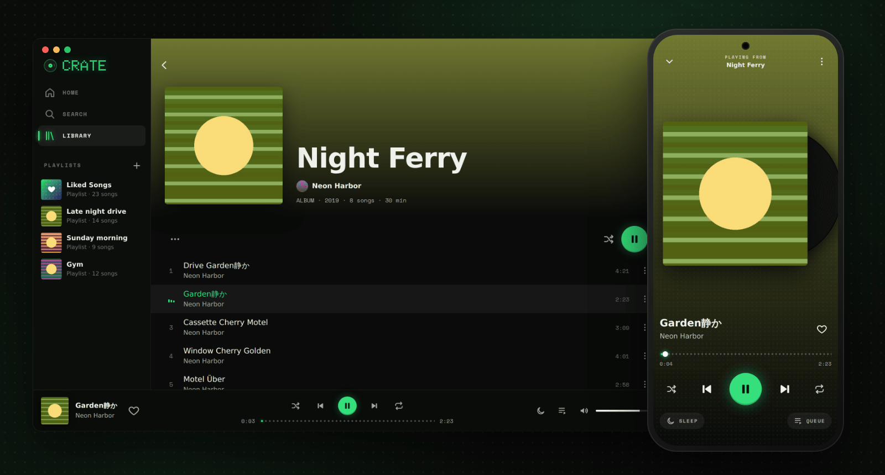
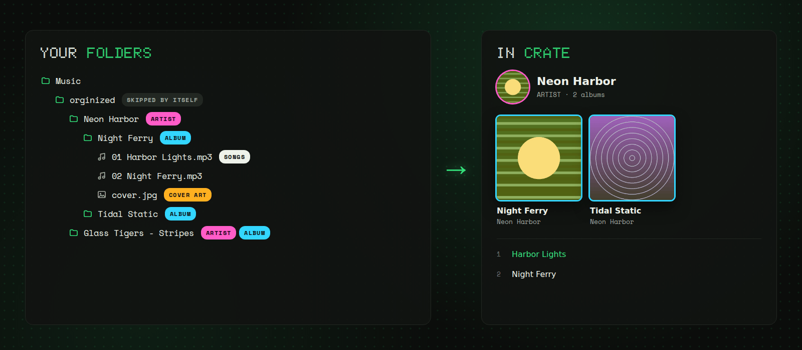
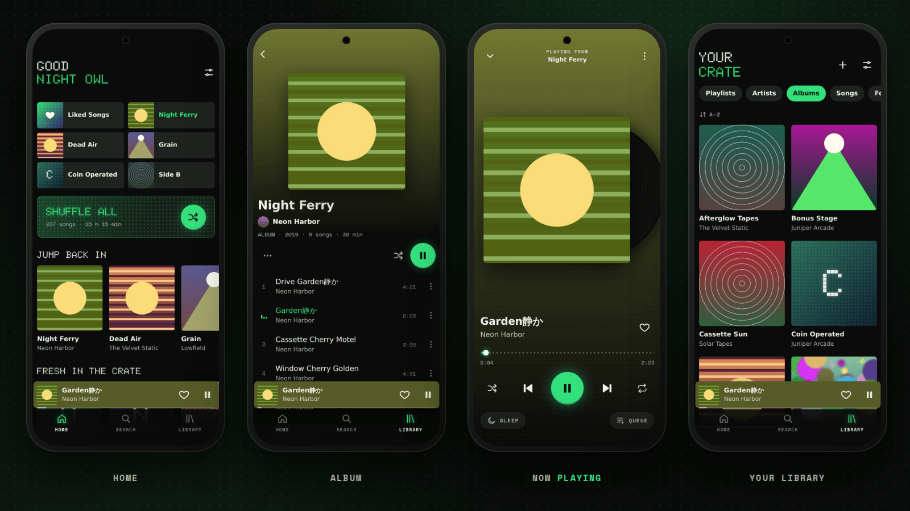
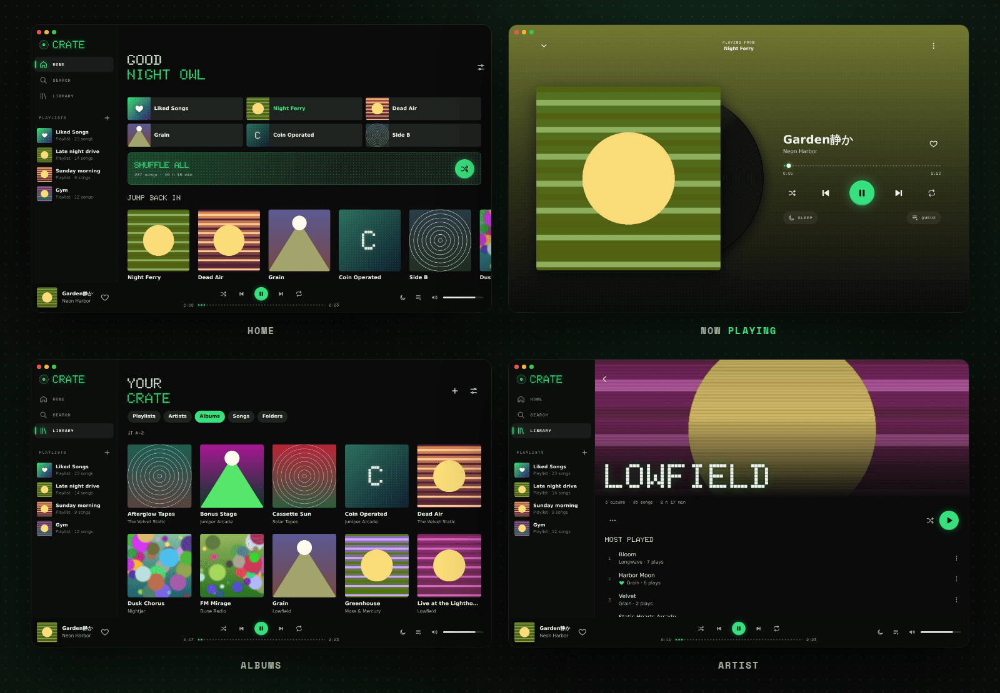
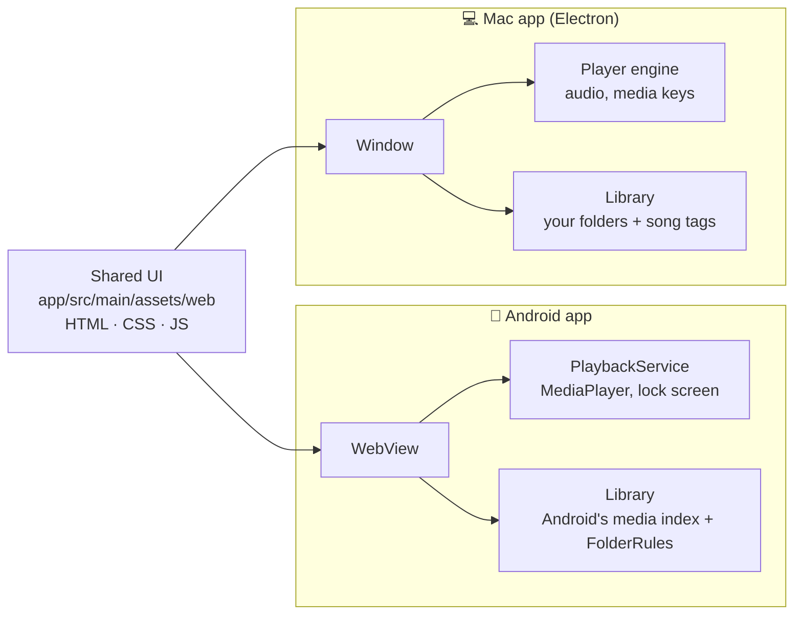

<p align="center">
  
</p>

<h1 align="center">Crate</h1>

<p align="center">
  <b>A retro, folder-first music player for Android and Mac.</b><br>
  Your music, straight from your folders. No account, no streaming, no tracking.
</p>

<p align="center">
  <a href="https://github.com/echad1on1/LocalPlayer/releases/latest"><b>⬇ Download</b></a> ·
  <a href="#install-on-android">Android</a> ·
  <a href="#install-on-a-mac">Mac</a> ·
  <a href="#organise-your-music">Folders</a> ·
  <a href="#troubleshooting">Help</a> ·
  <a href="#build-it-yourself">Build</a>
</p>

<p align="center">
  
</p>

Crate turns the folders on your device into a music library that looks and feels like a
streaming app, with artists, albums, playlists, shuffle and a spinning vinyl. It never goes online.

- 📁 **Your folders are your library.** `Artist/Album/song.mp3` becomes an artist with an album.
- 🎧 **Plays everything offline.** It keeps playing in the background and works with the lock screen, headphones, Bluetooth and media keys.
- 💚 **Liked Songs and your own playlists**, plus search, a queue and a sleep timer.
- 🕹 **Retro look**: dot-matrix fonts, a neon glow in 6 colours, and album colours that tint the screen.
- 📱💻 **Same app on your phone and your Mac.** One design, two apps.

---

## Contents

- [Download](#download)
- [Install on Android](#install-on-android)
- [Install on a Mac](#install-on-a-mac)
- [Organise your music](#organise-your-music)
- [What it can do](#what-it-can-do)
- [Using it](#using-it)
- [Troubleshooting](#troubleshooting)
- [Build it yourself](#build-it-yourself)
- [Make it yours](#make-it-yours)
- [How it works](#how-it-works)
- [Privacy and credits](#privacy-and-credits)

---

## Download

Get the newest version from the **[Releases page](https://github.com/echad1on1/LocalPlayer/releases/latest)**. Under **Assets**, pick:

| Your device | File to download | Needs |
| --- | --- | --- |
| Android phone | the `.apk` file | Android 11 or newer |
| Mac with Apple Silicon (M1, M2, M3, M4 …) | `Crate-…-mac-arm64.dmg` | macOS 12 or newer |
| Mac with an Intel chip | `Crate-…-mac-x64.dmg` | macOS 12 or newer |

> **Which Mac do I have?** Click the Apple menu (top left) → **About This Mac**. "Chip: Apple M…" means Apple Silicon. "Processor: Intel" means Intel.

---

## Install on Android

1. On your phone, open the [Releases page](https://github.com/echad1on1/LocalPlayer/releases/latest) and tap the **`.apk`** file under **Assets** to download it.
2. Tap the downloaded file (from the notification, or in **Files → Downloads**).
3. Android says it can't install apps from this source: tap **Settings**, switch on **Allow from this source**, then go back. *(You only do this once.)*
4. Tap **Install**. If Google Play Protect pops up, tap **More details → Install anyway** (or **Install without scanning**).
5. Open **Crate** and tap **Allow access to music**.

**Updating:** install the newer `.apk` the same way. Your liked songs, playlists and history stay.

---

## Install on a Mac

1. Download the right `.dmg` for your Mac (see [Download](#download)) and open it.
2. Drag **Crate** into the **Applications** folder.
3. Open Crate from Applications. The first time, macOS shows *"Apple could not verify 'Crate' is free of malware…"*. Click **Done**.
4. Open **System Settings → Privacy & Security** (on older macOS: **System Preferences → Security & Privacy**). Scroll down to *"Crate" was blocked…*, click **Open Anyway** and confirm when macOS asks again (password or Touch ID).

That's needed only once. It happens because Crate isn't signed with a paid Apple developer account, not because anything is wrong with it.

> **macOS says the app is "damaged"?** Open **Terminal** and run this once:
> ```
> xattr -cr /Applications/Crate.app
> ```

On first start, Crate reads your **Music** folder (`~/Music`). Is your music somewhere else? Use **File → Add Music Folder…** (⌘O) or **Settings → Music folders**.

---

## Organise your music

<p align="center">
  
</p>

Crate doesn't need perfect tags. **The folders decide** who the artist is and which album a song is on:

```
Music/
├── Neon Harbor/                  ← artist
│   ├── Night Ferry/              ← album
│   │   ├── 01 Harbor Lights.mp3
│   │   ├── 02 Night Ferry.mp3
│   │   └── cover.jpg             ← album art (optional)
│   └── Tidal Static/             ← another album
└── Glass Tigers - Stripes/       ← "Artist - Album" works too
```

| Your folders | In Crate |
| --- | --- |
| `Artist/Album/song.mp3` | artist **Artist**, album **Album** |
| `orginized/Artist/Album/song.mp3` | the same. One extra folder above your artists is skipped. |
| `Artist - Album/song.mp3` | artist **Artist**, album **Album** |
| `Album/song.mp3` | album **Album**, artist from the song's tags |
| `song.mp3` loose in the music folder | artist and album from the song's tags |
| `Artist/Album/CD1/…` and `CD2/…` | one album with two discs (Mac) |

**Good to know**

- **Album art:** Crate uses the picture inside the song file, or a `cover.jpg` / `folder.jpg` / `front.jpg` in the album folder.
- **Song order:** by the track numbers in the tags, otherwise by file name. Names like `01 …`, `02 …` sort nicely. Songs are always shown as **1, 2, 3 …**
- **Where Crate looks:**
  - **Phone:** it uses the **Music** folder. If there's no Music folder, it uses the folder that holds all your artist folders. To change this, go to **Settings → Music folders**.
  - **Mac:** your Music folder, plus any folders you add in **Settings → Music folders**.
- **New music shows up by itself** after you copy it in. There's also a **Rescan** button in Settings.
- **Phone:** keep each album's songs in one folder. Disc folders (`CD1`, `CD2`) are joined into one album only on the Mac so far.

---

## What it can do

<p align="center">
  
</p>

**Your library**
- **Home** with quick tiles, *Jump back in*, *Fresh in the crate*, *On repeat*, *Your artists* and a random *Dig the crate* row
- **Library** tabs for Playlists, Artists, Albums, Songs and Folders, sortable A–Z, by artist or by recently added
- **Search** across songs, artists, albums and folders
- **Liked Songs** and **your own playlists** (create, rename, add, remove)
- Artist pages with a *Most played* list, album pages with each song's length

**Playing**
- Shuffle, repeat (all / one), previous and next, plus seeking on a dotted progress bar
- A **queue** with *Play next* and *Add to queue*. Songs you queue stay next even when you shuffle.
- **Sleep timer:** 5 to 60 minutes, or *end of this song*
- Remembers your queue and position, even after a restart
- Counts plays, so *On repeat* and *Most played* learn what you like
- **6 glow colours:** green, amber, cyan, pink, red and white (Settings)

**On the phone**
- Background playback, lock-screen and notification controls
- Works with headphone buttons and Bluetooth, pauses when headphones are unplugged or a call comes in
- Gestures (see [Using it](#using-it))

**On the Mac**

<p align="center">
  
</p>

- Sidebar with your playlists, and a player bar with seek and volume
- **Media keys**, Control Center / Now Playing and the Dock menu (right-click the icon)
- Keyboard shortcuts for everything
- Closing the window keeps the music playing. **⌘Q** quits.
- Make the window narrow and you get the phone layout
- Right-click any song, album or artist for its menu (songs also have **Show in Finder**)
- Plays MP3, AAC/M4A, FLAC, OGG, Opus and WAV

---

## Using it

### On the phone

| Do this | To |
| --- | --- |
| Tap a song | play it (and the rest of the album or list after it) |
| Long-press a song, or tap **⋮** | like it, add it to a playlist, play next, add to queue, go to album or artist, song info |
| Swipe the mini player left or right | next or previous song |
| Swipe the mini player up, or tap it | open the player |
| Swipe the big cover left or right | next or previous song |
| Swipe the player down | close it |

### On the Mac

| Keys | Action |
| --- | --- |
| `Space` | play / pause |
| `⌘ →` / `⌘ ←` | next / previous song |
| `⌘ ↑` / `⌘ ↓` | volume up / down |
| `⌘ S` | shuffle on / off |
| `⌘ R` | repeat off → all → one |
| `⌘ L` | like the current song |
| `⌘ F` or `/` | search |
| `⌘ 1` / `⌘ 3` | Home / Your Library |
| `⌘ [` or `Esc` | go back / close |
| `⌘ N` | new playlist |
| `⌘ O` | add a music folder |
| `⌘ ⇧ R` | rescan your music |
| `⌘ ,` | settings |

---

## Troubleshooting

<details>
<summary><b>A folder name shows up as an artist (for example "orginized")</b></summary>

Your music has an extra folder level that Crate didn't recognise. Point Crate at the folder
that directly contains your artist folders:
**Phone:** Settings → Music folders → *Choose folders…* · **Mac:** Settings → Music folders → *Add folder…* (and remove the old one).
</details>

<details>
<summary><b>The songs of an album are in the wrong order</b></summary>

Crate sorts by the track numbers in the files. If those are missing or odd, it sorts by file name.
Renaming the files to `01 Title.mp3`, `02 Title.mp3` … always works.
</details>

<details>
<summary><b>No cover art</b></summary>

Put a `cover.jpg` (or `folder.jpg`) in the album folder, or add the picture to the files with a tag
editor (for example <a href="https://www.mp3tag.de/en/">Mp3tag</a>).
</details>

<details>
<summary><b>New songs don't show up</b></summary>

Give it a few seconds after copying. If they still don't appear, use <b>Settings → Rescan</b>.
Also check that the songs are inside one of the folders listed in <b>Settings → Music folders</b>.
</details>

<details>
<summary><b>Android: "App not installed"</b></summary>

This happens when an older Crate on the phone was signed with a different key (for example one you
built yourself in another way). Uninstall the old Crate first, then install the new `.apk`.
Uninstalling removes your liked songs and playlists.
</details>

<details>
<summary><b>Mac: "can't be opened", "could not verify" or "damaged"</b></summary>

See step 4 of [Install on a Mac](#install-on-a-mac) (**Open Anyway**). For "damaged", run
`xattr -cr /Applications/Crate.app` in Terminal once.
</details>

<details>
<summary><b>Mac: a song won't play</b></summary>

The Mac app plays MP3, AAC/M4A, FLAC, OGG, Opus and WAV. Apple Lossless (ALAC `.m4a`) and AIFF
files aren't supported yet. Crate skips a song it can't play and shows a message.
</details>

---

## Build it yourself

You don't need to install anything. GitHub builds both apps for you.

| Workflow (Actions tab) | Builds | Runs | Download from the finished run |
| --- | --- | --- | --- |
| **Build APK** | the Android app | on every change | `crate-apk` |
| **Build Mac app** | the Mac app for Apple Silicon and Intel | when `desktop/` or the UI changes | `Crate-Mac-AppleSilicon`, `Crate-Mac-Intel` |

To start one by hand: **Actions** → pick the workflow on the left → **Run workflow**.

<details>
<summary><b>Publish a release (so anyone can download it)</b></summary>

1. Download the files from the finished workflow runs and unzip them: you need the `.apk` and the two `.dmg` files.
2. On the repo page, go to **Releases → Draft a new release**. Make a tag like `v1.1` and add a title.
3. Drag the `.apk` and the `.dmg` files into the box at the bottom, then click **Publish release**.

Share `https://github.com/echad1on1/LocalPlayer/releases/latest`. It always points to the newest one.
</details>

<details>
<summary><b>Android Studio</b></summary>

**File → Open** this folder, wait for Gradle sync, then **Run ▶** (phone connected with USB debugging)
or **Build → Build APK(s)**. The project includes its signing key (`crate.jks`, password `cratecrate`),
so your builds install as updates over the released app.
</details>

<details>
<summary><b>Mac app on your own Mac</b></summary>

Install [Node.js](https://nodejs.org), then:

```
cd desktop
npm install
npm start          # run it
npm test           # run the tests
npm run dist:mac   # build the .dmg and .zip files into desktop/dist
```
</details>

---

## Make it yours

The screens are plain HTML, CSS and JavaScript **shared by both apps**, so a change there shows up on the
phone and on the Mac.

| Want to change… | Edit |
| --- | --- |
| Colours, fonts, spacing | `app/src/main/assets/web/app.css` (colours are at the top, in `:root`) |
| Screens and features | `app/src/main/assets/web/app.js` |
| How folders become artists/albums, phone | `app/src/main/java/app/crate/player/FolderRules.java` |
| How folders become artists/albums, Mac | `desktop/lib/folders.js` |
| Playback, notification, lock screen, phone | `app/src/main/java/app/crate/player/PlaybackService.java` |
| Playback, media keys, Mac | `desktop/renderer/engine.js` |
| Mac menus, window, music folders | `desktop/main.js` |
| App name, phone | `app/src/main/res/values/strings.xml` |
| App icon | `app/src/main/res/drawable/ic_launcher_fg.xml` (phone) · `desktop/build/icon.icns` (Mac) |

**Tip:** on the phone you can tweak the UI live. Turn on USB debugging, connect the phone and open
`chrome://inspect` in Chrome on your computer.

---

## How it works



Both apps show the same screens. Underneath, each one has its own player and music scanner.

---

## Privacy and credits

**Privacy:** Crate has no account, no ads, no analytics and no internet use. Your likes, playlists and play
counts stay on your device (on a Mac in `~/Library/Application Support/Crate`).

**Credits:** Fonts are [Doto](https://fonts.google.com/specimen/Doto) and
[Space Mono](https://fonts.google.com/specimen/Space+Mono) (SIL Open Font License, see
`app/src/main/assets/web/fonts`). The Mac app is built with [Electron](https://www.electronjs.org/) and reads tags with
[music-metadata](https://github.com/Borewit/music-metadata). The covers in the screenshots are made-up demo art.
